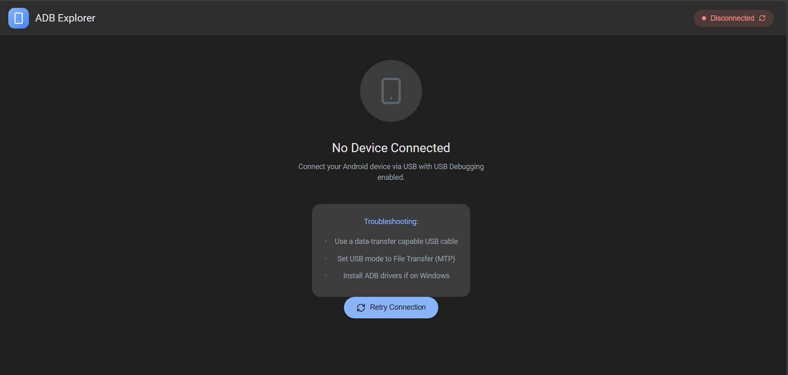
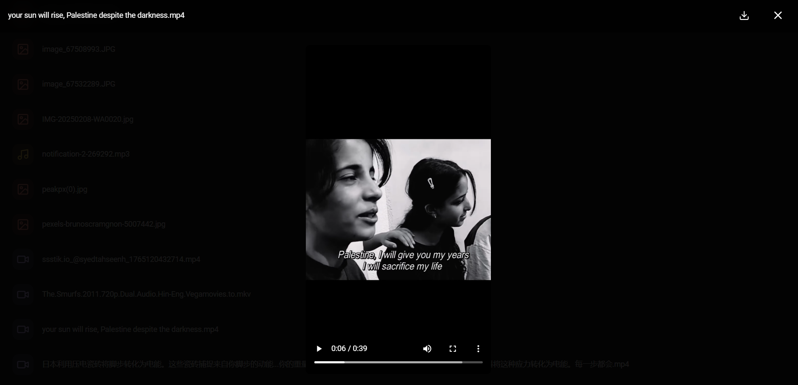

# ADB Explorer 📱💻

A modern web-based file explorer for Android devices using ADB (Android Debug Bridge).

I created this project because my Android phone sometimes doesn't work with the built-in file transfer, and network sharing is too slow.

[](https://github.com/muhammadfaraz800/adb-explorer)

---

## ✨ Features

### 📁 File Explorer
- Browse directories and files on your Android device with a clean, intuitive interface
- Visual file icons for different file types (images, videos, documents, etc.)
- Breadcrumb navigation for easy path tracking
- History navigation with back button support

### ⚡ High-Speed File Transfer
- **Parallel chunk downloading** for large files (5-10GB)
- Real-time download progress tracking
- Much faster than built-in MTP or network sharing

### 🖼️ Built-in Media Viewer
- View images directly in the browser with zoom support
- Stream videos without downloading first
- Preview text files and documents

### 🔗 Smart Connection Handling
- Detects if device is **Unauthorized** and prompts to allow USB debugging
- **Retry Connection** button to restart ADB server if issues occur
- Real-time connection status indicator

### 📥 File Operations
- **Download**: Copy files from device to computer at high speed
- **Delete**: Remove files or directories
- **View**: Open files directly in browser without copying

---

## 📸 Screenshots

### Home Screen


### File & Folder Navigation


### Built-in Media Viewer


---

## 🛠️ Technology Stack

| Layer | Technology |
|-------|------------|
| **Frontend** | React + Vite |
| **Backend** | Node.js + Express |
| **Styling** | CSS with Material Design inspiration |
| **Connection** | ADB (Android Debug Bridge) |

---

## 🚀 How to Use

### Prerequisites

1. **Node.js** - Install from [nodejs.org](https://nodejs.org)
2. **ADB** - Install Android Platform Tools and add to system PATH
   - Download from [Android Developer Site](https://developer.android.com/studio/releases/platform-tools)
3. **Android Device** with USB Debugging enabled
   - Go to *Settings → About Phone → Tap "Build Number" 7 times*
   - Then *Settings → Developer Options → Enable USB Debugging*

### Installation

1. **Clone the repository**
   ```bash
   git clone https://github.com/muhammadfaraz800/adb-explorer.git
   cd adb-explorer
   ```

2. **Install dependencies**
   ```bash
   npm install
   ```

3. **Start the application**
   ```bash
   npm run dev
   ```

4. **Open your browser** at `http://localhost:5173`

### Connecting Your Device

1. Connect your Android device via USB cable
2. On your phone, allow the USB debugging prompt
3. The app will automatically detect your device
4. Start browsing your files!

### Troubleshooting

| Issue | Solution |
|-------|----------|
| Device not detected | Click "Retry Connection" button |
| Unauthorized device | Check your phone for the USB debugging prompt and tap "Allow" |
| ADB not found | Ensure ADB is installed and added to your system PATH |

---

## 📄 License

MIT License - Feel free to use and modify!

---

Made with ❤️ by [Muhammad Faraz](https://github.com/muhammadfaraz800)
